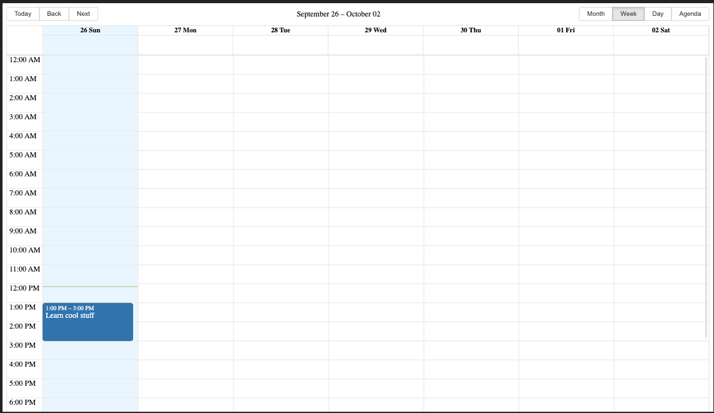
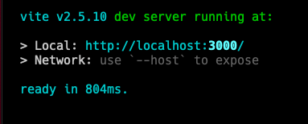
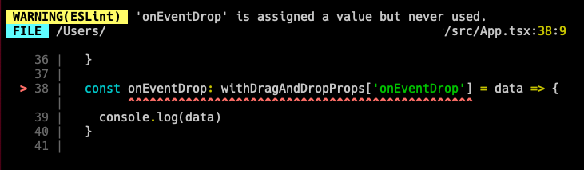

# React Big Calendar Demo with Drag and Drop

Demo for using [react-big-calendar](https://github.com/jquense/react-big-calendar). with drag and drop functionality.

## Screenshot

## Highlights

- `date-fns` as a localizer
- TypeScript
- React 17 hooks
- [Vite](https://vitejs.dev/) for running and building
- ESLint and Prettier

## Setup

Clone this repository, or use the green "Use as template" to create a new GitHub repo with this exact source

Once cloned, run `yarn` to install the dependencies needed.

## Running 

To run the demo, run `yarn dev` to begin the dev server.

In your terminal, you'll see the output of Vite

Whenever there is an ESLint or TypeScript issue, you'll see the error in the terminal and in the browser. Just like create-react-app

